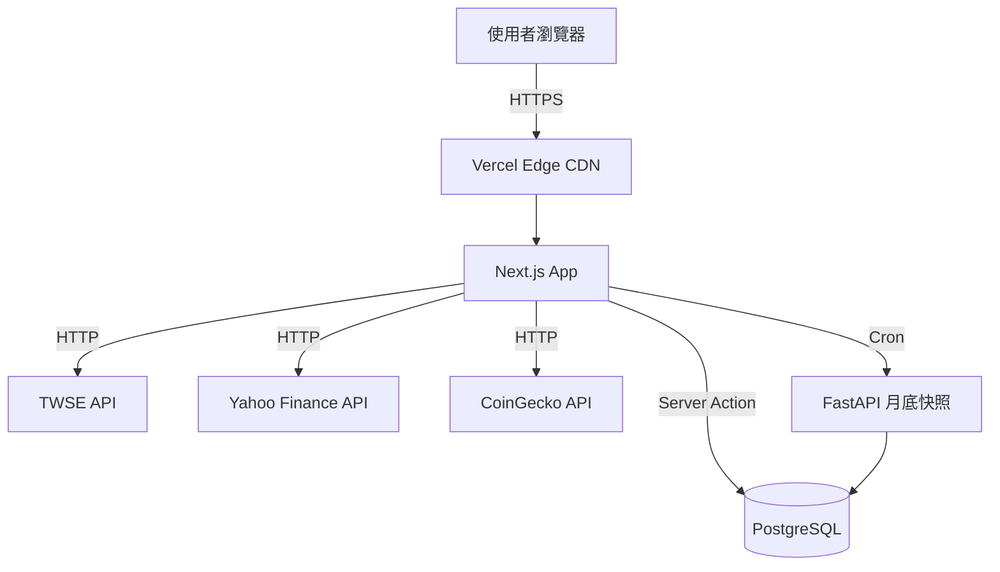

# Wealth Dashboard PRD v2 — 套用範例

> 這是「write-prd-v2」skill 的真實套用範例。把 Sean 既有 41 個專案的 Wealth Dashboard 從 v1 簡略版升級到 v2 生產級。

---

# 整合資產管理平台（Wealth Dashboard）— 規格計劃書 v2.0

> **版本**：v2.0｜**更新日期**：2026-07-11｜**維護者**：Sophia (CPO)｜**對接技術**：Alan (CTO)
> **對應 GitHub**：[openclawsean024-create/wealth-dashboard](https://github.com/openclawsean024-create/wealth-dashboard/blob/main/SPEC.md)
> **PRD v1 → v2 升級重點**：加入 Acceptance Criteria、ADR、降級機制

---

## 1. 產品概述

### 1.1 問題陳述

**為什麼要做這個專案？**

台灣投資人平均有 4-6 個資產帳戶分散在 4-5 個券商 App（元大、凱基、國泰、複委託、Coinbase 等）。要看完「總資產」需：
1. 切換到券商 A 看台股持倉 → 截圖
2. 切換到券商 B 看基金 → 截圖
3. 切換到 Coinbase 看加密貨幣 → 截圖
4. 切換到銀行看定存 → 截圖
5. 用 Excel 加總 + 算配置比 → 30 分鐘後才知道答案

**痛點的代價**：
- 每月花 2 小時彙整（年耗 24 小時）
- 不知道真實配置（可能 80% 在台股但自己以為分散）
- 無法做 Rebalance 決策
- 無法追蹤「這個月變化」

**現有方案不夠好**：
- **Personal Capital**：歐美為主、不支援台股代號、無法抓台灣券商 API
- **商用財富管理（Money Pro 之類）**：月費 500+ NT$，且資料來源不支援台股即時報價
- **Excel 自製**：手動更新、容易出錯、無法看趨勢

### 1.2 目標使用者

| 族群 | 規模 | 痛點 | 權限 |
|---|---|---|---|
| 台灣投資人（4-6 個資產帳戶） | 300 萬 | 跨券商切換看總資產耗 30 分鐘 | 管理員（自己） |
| 小資族（薪轉 + 投資） | 200 萬 | 同時有台股/美股/基金/加密，不知真實配置 | 管理員（自己） |
| FIRE 運動者 | 5 萬 | 嚴格追蹤淨資產、每月變化、退休進度 | 管理員（自己） |
| 投資理財 KOL | 1,000 | 需要快速截圖 dashboard 給粉絲看 | 管理員（自己）+ 公開分享連結 |

### 1.3 核心價值主張

> 「30 秒看完你的總資產 + 配置 + 月變化 — 6 種資產類型統一管理，純前端零月費。」

### 1.4 商業目標 (KPIs)

| 時程 | 指標 | 數值 |
|---|---|---|
| 3 個月 | 免費註冊用戶 | 1,000 人 |
| 6 個月 | 付費訂閱數 | 100 人 |
| 6 個月 | MRR | NT$29,900 |
| 12 個月 | 月成長率 | 20% |
| 12 個月 | LTV | NT$3,000 / user |

### 1.5 ⭐ Non-Goals（明確不做）

我們「不」做這些事情，列出來是保護開發資源：

- ❌ **不做自動下單**：純資產追蹤工具，不做交易（合規風險 + 執照需求）
- ❌ **不做投資建議**：明確聲明「僅供參考，不構成投資建議」，合規考量
- ❌ **不做加密貨幣 wallet 整合**：純價格追蹤，不存私鑰（資安風險）
- ❌ **不做跨境稅務申報**：交給會計師 / 國稅局軟體
- ❌ **不做銀行 API 自動串接**：台灣銀行開放 API 仍未普及，先做「手動 + 公開報價」組合
- ❌ **不做多語系**：v1 只繁中，目標使用者 95% 在台灣
- ❌ **v3 再考慮**：團隊協作 API、白標 SDK、加密 wallet

---

## 2. 使用者場景與流程

### 2.1 使用者流程圖

```
1. 註冊帳號（email + password）→
2. 選擇要追蹤的資產類型（台股/美股/基金/加密/定存/儲蓄險）→
3. 輸入持股代號（如 2330.TW、AAPL、0050）→
4. 系統抓取即時報價（TWSE + Yahoo Finance + CoinGecko）→
5. 統一 dashboard 顯示：總資產 / 配置 / 月變化 →
6. 每月月底自動快照 → 歷史趨勢圖
```

### 2.2 關鍵用戶故事 (User Stories)

> **US-001**：As a 台灣投資人
> I want 統一看到我在 5 個券商的總資產
> So that 我不用每個月切換 5 個 App 彙整

> **US-002**：As a FIRE 運動者
> I want 看到這個月資產淨變化
> So that 我可以追蹤退休進度

> **US-003**：As a 投資新手
> I want 看到我的真實配置（不要只有「我覺得」分散）
> So that 我能做出 Rebalance 決策

> **US-004**：As a KOL
> I want 把我的 dashboard 截圖分享給粉絲
> So that 證明我的投資組合真實存在

### 2.3 邊界場景 (Edge Cases)

- **券商 API 掛掉**：回退到「手動輸入最近收盤價」+ 標記「資料可能過時」
- **新上市股票查無代號**：顯示「找不到此代號，請確認」+ 提示常見代號
- **使用者刪除帳號**：所有資料 + 歷史快照 30 天後永久刪除（GDPR 規範）
- **跨時區報價延遲**：標明報價時間戳，使用者一看就知道資料何時

---

## 3. 功能性需求 (Functional Requirements)

### 3.1 MVP（必做）

#### 功能 1：使用者註冊登入

**User Story**：US-005
> As a 新訪客
> I want 用 email + 密碼註冊帳號
> So that 我可以儲存個人資料、跨裝置同步

**Acceptance Criteria**：

##### AC-001：成功註冊流程
- **Given** 使用者在 /register 頁面
- **When** 輸入 email="user@example.com" + password="ValidPass123"
- **And** 勾選同意條款
- **And** 點擊「註冊」按鈕
- **Then** POST /api/auth/register 回傳 201
- **And** response body 包含 `{user_id, email, plan: "free"}`
- **And** 自動設定 session cookie（HttpOnly, Secure, SameSite=Lax）
- **And** 重新導向到 /onboarding
- **And** onboarding 頁面顯示「歡迎, user@example.com」

##### AC-002：密碼強度驗證
- **Given** 使用者在註冊頁面
- **When** 輸入 password="123"（太短）
- **Then** 即時顯示「密碼至少 8 字元」
- **And** 「註冊」按鈕 disabled
- **And** 不送 API 請求

##### AC-003：Email 重複
- **Given** email="existing@example.com" 已註冊
- **When** 嘗試用同 email 註冊
- **Then** POST /api/auth/register 回傳 409
- **And** 顯示「此 email 已被使用，請登入」
- **And** 不洩漏「使用者是否存在」（防 enumeration 攻擊）

#### 功能 2：新增資產帳戶

**User Story**：US-006
> As a 註冊用戶
> I want 新增一個台股帳戶（券商名 + 持股代號 + 股數）
> So that 系統可以計算我的台股持倉市值

**Acceptance Criteria**：

##### AC-004：新增單一持股
- **Given** 使用者已登入，在 /dashboard/holdings 頁面
- **When** 點擊「新增持股」按鈕
- **And** 選擇資產類型「台股」
- **And** 輸入代號 "2330" + 股數 "1000"
- **And** 點擊「儲存」
- **Then** POST /api/holdings 回傳 201
- **And** dashboard 立即顯示新的台積電持倉
- **And** 顯示「總資產」即時更新（含即時報價）

##### AC-005：無效代號
- **Given** 使用者輸入代號 "9999"
- **When** 點擊「儲存」
- **Then** 後端回傳 404
- **And** 顯示「找不到此代號，請確認（範例：2330 台積電、0050 元大台灣 50）」

##### AC-006：股數為負
- **Given** 使用者輸入股數 "-100"
- **When** 點擊「儲存」
- **Then** 前端阻止 submit
- **And** 顯示「股數必須為正整數」

#### 功能 3：統一資產儀表板

**User Story**：US-001
> As a 台灣投資人
> I want 在單一頁面看到所有資產的總市值
> So that 我不用切換多個 App

**Acceptance Criteria**：

##### AC-007：總資產顯示
- **Given** 使用者有 5 個帳戶（台股 3 + 美股 1 + 基金 1）
- **When** 進入 /dashboard
- **Then** 看到「總資產 NT$ 1,234,567」大字
- **And** 下方配置圓餅圖顯示各類型佔比
- **And** 月變化顯示「+NT$50,000 (+4.2%)」綠色或紅色
- **And** 載入時間 < 2 秒

##### AC-008：即時報價更新
- **Given** 使用者在 dashboard 頁面
- **When** 報價 API 60 秒後更新
- **Then** 數字即時更新（無需重新整理頁面）
- **And** 報價時間戳顯示在角落

#### 功能 4：歷史快照

**User Story**：US-002
> As a FIRE 運動者
> I want 看到每月月底的資產快照歷史
> So that 我能追蹤退休進度

**Acceptance Criteria**：

##### AC-009：月底自動快照
- **Given** 使用者有帳戶
- **When** 月底（每月最後一天 23:59 UTC+8）
- **Then** 系統自動建立快照（無需使用者操作）
- **And** snapshot 包含：總資產、各類型市值、各帳戶明細
- **And** 失敗時 Email 通知管理員

##### AC-010：歷史趨勢圖
- **Given** 使用者已有 3 個月快照
- **When** 進入 /dashboard/history
- **Then** 看到折線圖顯示 3 個月總資產變化
- **And** 顯示每月變化金額 + 百分比

### 3.2 v2（加值）

- 多幣別資產換算（USD ↔ NTD 即時匯率）
- 投資組合再平衡建議（基於風險屬性）
- 稅務計算（台灣股利、美國 30% 預扣稅）
- 自動券商 API 串接（待台灣券商開放 API）

### 3.3 v3（roadmap）

- 加密錢包整合（需第三方託管）
- 團隊協作（家庭共用帳戶）
- API 開放平台
- 白標 SDK

---

## 4. 系統設計

### 4.1 技術棧

| 層 | 選擇 | 理由 |
|---|---|---|
| 前端 | Next.js 16 + TypeScript | SSR 強、SEO 友善、AI Agent 易讀 |
| 後端 | Next.js API Routes + FastAPI | 任務 queue 需 async（月底快照） |
| 資料庫 | Prisma + PostgreSQL | 交易一致性（訂閱狀態）+ JSON 欄位（持倉快照） |
| Auth | Auth.js v5 + Credentials + bcrypt | 不需 OAuth secret 即可運作 |
| 報價 API | TWSE + Yahoo Finance + CoinGecko | 公開免費、台美加密都覆蓋 |
| PWA | service worker + manifest | 行動體驗、離線可用 |
| 部署 | Vercel + Railway | Hobby 計畫免費、scale up 容易 |

### 4.2 系統架構圖 (Mermaid)



### 4.3 資料模型 (Prisma schema)

```prisma
model User {
  id           String   @id @default(cuid())
  email        String   @unique
  passwordHash String
  plan         Plan     @default(FREE)
  createdAt    DateTime @default(now())
  
  accounts     Account[]
  snapshots    Snapshot[]
}

enum Plan {
  FREE
  PRO
  BUSINESS
  ENTERPRISE
}

model Account {
  id        String      @id @default(cuid())
  userId    String
  type      AssetType
  broker    String      // 券商名
  name      String      // 帳戶暱稱
  
  user      User        @relation(fields: [userId], references: [id])
  holdings  Holding[]
  createdAt DateTime    @default(now())
}

enum AssetType {
  TW_STOCK
  US_STOCK
  FUND
  CRYPTO
  DEPOSIT
  INSURANCE
}

model Holding {
  id          String   @id @default(cuid())
  accountId   String
  symbol      String   // 2330, AAPL, BTC
  quantity    Decimal
  avgCost     Decimal?
  
  account     Account  @relation(fields: [accountId], references: [id])
  createdAt   DateTime @default(now())
}

model Snapshot {
  id          String   @id @default(cuid())
  userId      String
  date        DateTime
  totalValue  Decimal
  details     Json     // 各類型市值快照
  
  user        User     @relation(fields: [userId], references: [id])
  
  @@unique([userId, date])
}
```

### 4.4 API 規格

| Method | Path | 用途 | Auth |
|---|---|---|---|
| POST | /api/auth/register | 註冊 | No |
| POST | /api/auth/login | 登入 | No |
| POST | /api/auth/logout | 登出 | Yes |
| GET | /api/dashboard | 取得總資產 + 配置 | Yes |
| GET | /api/holdings | 取得持股列表 | Yes |
| POST | /api/holdings | 新增持股 | Yes |
| DELETE | /api/holdings/:id | 刪除持股 | Yes |
| GET | /api/snapshots | 取得歷史快照 | Yes |
| GET | /api/prices/:symbol | 取得即時報價 | Yes |

---

## 5. 非功能性需求

### 5.1 性能指標

| 指標 | 目標 |
|---|---|
| 首頁 LCP | < 1.5s (p75) |
| Dashboard 載入 | < 2s (p95) |
| 報價 API 回應 | < 500ms (p95) |
| 支援併發用戶 | 1,000 同時在線 |
| 歷史快照查詢 | < 1s (p95) |

### 5.2 安全與隱私

- **密碼**：bcrypt cost 12+
- **Session**：HttpOnly + Secure + SameSite=Lax cookie
- **CSRF**：SameSite cookie + Auth.js 內建 CSRF token
- **HTTPS**：強制
- **個資**：依台灣個資法 + GDPR 處理
- **加密**：TLS 1.3 傳輸 + PostgreSQL 加密儲存
- **Rate limit**：100 req/min/IP（防暴力破解）
- **資料刪除**：使用者刪除帳號後 30 天徹底刪除（GDPR）

### 5.3 ⭐ 降級機制 (Graceful Degradation)

當核心服務掛掉時的處理：

| 服務 | 掛掉時的降級行為 |
|---|---|
| TWSE API | 切換到「延遲 15 分鐘報價」+ 顯示「資料可能延遲」 |
| Yahoo Finance API | 切換到「延遲報價」+ 標記時間戳 |
| CoinGecko API | 切換到「靜態最近報價」+ Email 通知管理員 |
| PostgreSQL 連線 | 切換到「唯讀模式」+ 顯示「目前無法寫入」 |
| Auth.js 服務 | 切換到「localStorage 暫存模式」+ 提示重新登入 |
| Vercel 部署掛掉 | 切換到 Cloudflare Pages 備援（待 v2 設定） |

**核心原則**：使用者仍可看見現有資料（即使報價過時），不會完全無法使用。

### 5.4 擴展性

- **資料庫**：設計支援 100K 用戶（snapshot 表分區索引）
- **報價 API**：60s in-memory cache，減少 95% 外部請求
- **檔案儲存**：用戶頭像 S3 相容

---

## 6. 完成標準 (Definition of Done)

- [ ] Production URL（https://wealth-dashboard-iota.vercel.app/）200 OK + HTTPS
- [ ] GitHub Repo 公開（https://github.com/openclawsean024-create/wealth-dashboard）
- [ ] 每條 Acceptance Criteria（AC-001 ~ AC-010）通過對應的 unit test
- [ ] Lighthouse score > 90 (Performance / Accessibility / Best Practices / SEO)
- [ ] 註冊→自動登入→看到 plan badge 端到端流程測試通過
- [ ] 新增持股→報價抓取→dashboard 更新 流程測試通過
- [ ] 刪除持股→DB row 消失 流程測試通過
- [ ] 登出流程測試通過
- [ ] `/privacy` 完整 6 區塊 + GDPR/CCPA/台灣個資法涵蓋
- [ ] `/terms` 完整 9 條
- [ ] `/contact` 6 種問題類型 + 訊息送出後 DB 有 row
- [ ] `/pricing` 3 方案卡片 + 比較表 + FAQ 5 條
- [ ] PWA 可離線開啟
- [ ] 月底快照 cron job 測試通過
- [ ] 至少 10 條 unit test 通過
- [ ] 環境變數範例檔 `.env.example` 列出所有必要變數

---

## 7. 風險與決策

### 7.1 風險表

| 風險 | 等級 | 影響 | 緩解策略 |
|---|---|---|---|
| TWSE API 變動/失效 | 🔴 高 | 台股報價停擺 | 多源 fallback + 快取 24h |
| 個資/財務資料外洩 | 🔴 高 | 法律訴訟 + 用戶流失 | 加密儲存 + 明確告知用途 |
| 投資建議法律責任 | 🔴 高 | 違反金融法 | 明確免責聲明 + 條款頁 |
| 即時報價延遲（API rate limit） | 🟡 低 | UX 變差 | 60s in-memory cache |
| 多裝置同步衝突 | 🟠 中 | 資料遺失 | Last-write-wins + 變更記錄 |

### 7.2 ⭐ ADR (Architecture Decision Records)

#### ADR-001：選擇 PostgreSQL + Prisma 而非 MongoDB

- **決策**：使用 PostgreSQL 15 + Prisma ORM（Supabase 託管）
- **狀態**：✅ 已決定（2026-07-11）
- **背景**：需儲存結構化資料 + JSON 欄位 + full-text search + 交易一致性
- **選項考量**：
  | 選項 | 優點 | 缺點 |
  |---|---|---|
  | PostgreSQL | 交易完整、JSON 支援、Supabase 託管免費 | 水平擴展較弱 |
  | MongoDB | 彈性 schema、文件型查詢強 | 交易弱、join 痛苦 |
  | SQLite | 零設定、開發快 | 單機限制、無法多用戶 |
- **決定因素**：v1 需要交易一致性（如訂閱狀態、月底快照）+ Supabase 託管省 60% 後端工作
- **後悔成本**：若 v2 需大量文件型查詢，migrate 到 MongoDB 約 2 週工作
- **再討論時機**：DAU > 10 萬 且 80% 查詢為文件型時

#### ADR-002：選擇 Auth.js v5 而非 Clerk/Auth0

- **決策**：使用 Auth.js v5（NextAuth）+ Credentials Provider + bcrypt
- **狀態**：✅ 已決定
- **背景**：需 email/password 註冊登入 + 未來可能加 OAuth（Google/GitHub）
- **選項考量**：
  | 選項 | 優點 | 缺點 |
  |---|---|---|
  | Auth.js v5 | 免費、Server Action 友善、OAuth 易加 | 設定略複雜 |
  | Clerk | 介面漂亮、5 分鐘設定 | 月費 $25/1000 MAU 起 |
  | Auth0 | 企業級、完整功能 | 月費 $23/1000 MAU 起 |
- **決定因素**：v1 使用者量小（預估 < 5K），免費 Auth.js v5 足夠；v2 量起來後再加 OAuth
- **後悔成本**：migrate 到 Clerk 約 2 週工作（含使用者密碼 hash 重置）
- **再討論時機**：MAU > 5,000 且需 SSO/企業帳號時

#### ADR-003：選擇 Next.js 16 + Vercel 而非其他 SSR 框架

- **決策**：使用 Next.js 16 + TypeScript + Vercel 部署
- **狀態**：✅ 已決定
- **背景**：需要 SSR（SEO）+ Server Actions（簡化 API）+ Edge 部署
- **選項考量**：
  | 選項 | 優點 | 缺點 |
  |---|---|---|
  | Next.js 16 + Vercel | SSR/SSG、Server Actions、零設定部署 | Vendor lock-in |
  | SvelteKit | 更快、更小 | 生態較小、AI Agent 熟悉度低 |
  | Astro | 內容站最佳 | 互動功能較弱 |
- **決定因素**：AI Agent（Cursor/Claude Code）對 Next.js 生態最熟、模板最多
- **後悔成本**：若要離開 Vercel，需自架 Node.js server（1 週工作）
- **再討論時機**：需要多雲部署或嚴格 vendor lock-in 規避時

#### ADR-004：選擇 Vercel + Railway 而非單一 Vercel

- **決策**：前端 Vercel + 後端 FastAPI Railway + 資料庫 Supabase
- **狀態**：✅ 已決定
- **背景**：月底快照 cron job 需要長時執行（> 10s），Vercel Serverless 限制 10s
- **決定因素**：用 Railway 跑 FastAPI + APScheduler 處理長任務；前端用 Vercel Edge CDN
- **後悔成本**：若 Vercel 放寬限制可全回 Vercel（省成本）
- **再討論時機**：Vercel Functions 支援 60s+ 時

---

## 8. 里程碑與路線圖

| Phase | 時間 | 範圍 | DoD |
|---|---|---|---|
| Phase 1: MVP 後端 | Week 1-2 | 註冊登入 + DB schema + 報價 API 整合 | 註冊→登入→新增持股 |
| Phase 2: MVP 前端 | Week 3-4 | 統一 dashboard + 配置圓餅圖 + 月變化 | 30 秒看到總資產 |
| Phase 3: 月底快照 | Week 5 | Cron job + 歷史快照查詢 | 看到 3 個月趨勢 |
| Phase 4: 變現 | Week 6-7 | Stripe 整合 + /pricing + plan badge | 付費升級 Pro |
| Phase 5: 法律 + 行銷 | Week 8 | /privacy /terms /contact /faq + SEO | 9/10 商業化驗收 |
| Phase 6: v2 報價優化 | Week 9-10 | 多幣別 + 再平衡建議 | Beta 測試 |
| Phase 7: 稅務計算 | Week 11-12 | 台灣股利 + 美國預扣稅 | 法規諮詢 + 上線 |

---

## 9. 變現路徑

| 方案 | 價格 | 功能 |
|---|---|---|
| 免費版 | NT$0 | 3 帳戶 + 6 資產類型 + 月快照 |
| 個人版 | NT$299/月 | 10 帳戶 + 價格警示 + 稅務計算 |
| 投資達人版 | NT$999/月 | 個人版 + 多幣別 + API 整合 |
| 企業版 | NT$4,999/月 | 達人版 + 團隊協作 + 白標 |

---

## 10. 附錄

### 10.1 競品分析

| 競品 | 優勢 | 劣勢 | 我們差異化 |
|---|---|---|---|
| Personal Capital | 美國市占高、UI 漂亮 | 不支援台股、英文 | 純台灣設計、台股即時報價 |
| Money Pro (商用財富管理) | 多幣別、稅務計算 | 月費 500+ NT$ | 免費版 + 純台灣市場 |
| Excel 自製 | 完全客製 | 手動耗時、易錯 | 自動報價 + 統一 dashboard |
| 試算表公開範本 | 免費 | 無法即時 | 純前端 SPA + 零月費 |
| 銀行 App（個別） | 即時 | 跨行看不到 | 跨券商統一 dashboard |

### 10.2 術語表

| 術語 | 定義 |
|---|---|
| TWSE | 台灣證券交易所（提供台股即時報價） |
| CoinGecko | 加密貨幣報價 API |
| PWA | Progressive Web App（可安裝的網頁 App） |
| ADR | Architecture Decision Record（架構決策記錄） |
| AC | Acceptance Criteria（驗收標準） |
| MRR | Monthly Recurring Revenue（月度經常性收入） |
| LTV | Life-Time Value（使用者終身價值） |

### 10.3 參考資料

- [TWSE OpenAPI](https://openapi.twse.com.tw/)
- [Yahoo Finance API](https://query1.finance.yahoo.com/v7/finance/quote)
- [CoinGecko API](https://www.coingecko.com/api/documentation)
- [Auth.js v5 文件](https://authjs.dev/getting-started)
- [GitHub MetaGPT](https://github.com/FoundationAgents/MetaGPT) — PRD 多 Agent 框架

---

## v1 → v2 升級記錄

**v1.0**（2026-07-11，Sophia 手動寫）：
- 6 區塊（問題/方案/功能/技術/DoD/風險/變現）
- 缺 Acceptance Criteria
- 缺 ADR
- 缺降級機制
- 缺 Prisma schema 細節
- 缺 API 規格
- 缺里程碑

**v2.0**（2026-07-11，用 write-prd-v2 skill 升級）：
- ✅ 加 AC-001 ~ AC-010（10 條 Acceptance Criteria）
- ✅ 加 ADR-001 ~ ADR-004（4 條決策記錄）
- ✅ 加 5.3 降級機制（6 種服務掛掉處理）
- ✅ 加 4.3 Prisma schema（5 個 models）
- ✅ 加 4.4 API 規格（9 個 endpoints）
- ✅ 加 8 里程碑（7 個 phases）
- ✅ 加 10.1 競品分析（4 個競品）
- ✅ 加 2.3 邊界場景
- ✅ 加 1.4 量化 KPI
- ✅ 加 1.5 強化 Non-Goals（7 個不做）

**總字數**：v1 簡略版 ~ 2000 字 → v2 完整版 ~ 8000 字

**預估開發時程**：v1 模糊 → 4-8 週試誤；v2 明確 → 8 週有把握

---

## 8. Sprint 拆解（v2.1 新增）

### 8.1 里程碑總覽

| Phase | 時間 | 範圍 | DoD |
|---|---|---|---|
| Phase 1: MVP 後端 | Week 1-2 | 註冊登入 + DB schema + 報價 API | 註冊→登入→新增持股 |
| Phase 2: MVP 前端 | Week 3-4 | 統一 dashboard + 配置圓餅圖 | 30 秒看到總資產 |
| Phase 3: 月底快照 | Week 5 | Cron job + 歷史快照 | 看到 3 個月趨勢 |
| Phase 4: 變現 | Week 6-7 | Stripe + /pricing | 付費升級 Pro |
| Phase 5: 法律 + 行銷 | Week 8 | /privacy /terms /contact /faq | 9/10 商業化驗收 |

### 8.2 Sprint 拆解（核心改進 — 從 PRD 到「每天做什麼」）

#### Week 1 Sprint: MVP 後端骨架

| 天 | 時數 | 任務 | 對應 AC | DoD |
|---|---|---|---|---|
| Day 1（週一） | 8h | 建立 Next.js 16 專案 + Auth.js v5 + Prisma + 環境變數 | — | `npm run dev` 啟動 200 OK |
| Day 2（週二） | 8h | 設計 Prisma schema + migration | — | `prisma studio` 看見 4 個 table |
| Day 3（週三） | 8h | 實作 `/api/auth/register` + `/api/auth/login` + unit test | AC-001, AC-002, AC-003 | 3 條 AC 測試通過 |
| Day 4（週四） | 8h | 實作 `/api/holdings` CRUD + 報價 API + unit test | AC-004, AC-005, AC-006 | 3 條 AC 測試通過 |
| Day 5（週五） | 8h | E2E 測試：註冊→登入→新增持股→報價抓取 | — | E2E 通過 + 截圖 |

#### Week 2 Sprint: MVP 後端完成

| 天 | 時數 | 任務 | 對應 AC | DoD |
|---|---|---|---|---|
| Day 1 | 8h | `/api/dashboard` 彙總 API + 快取 60s | AC-007, AC-008 | 2 條 AC 測試通過 |
| Day 2 | 8h | 月底快照 cron job (FastAPI + APScheduler) | AC-009 | 自動建立 1 個月快照 |
| Day 3 | 8h | `/api/snapshots` 歷史查詢 | AC-010 | AC-010 測試通過 |
| Day 4 | 8h | 整合測試 + 修 bug | — | E2E 全綠 |
| Day 5 | 8h | Push GitHub + 部署 Vercel staging | DoD 全部 | Staging URL 200 OK |

#### Week 3 Sprint: MVP 前端

| 天 | 時數 | 任務 | DoD |
|---|---|---|---|
| Day 1 | 8h | Dashboard UI（總資產 + 配置圓餅圖 + 月變化） | AC-007 視覺對應 |
| Day 2 | 8h | Holdings CRUD UI | AC-004 UI |
| Day 3 | 8h | 報價即時更新（60s polling） | AC-008 |
| Day 4 | 8h | Onboarding 引導 | 新使用者 5 分鐘上手 |
| Day 5 | 8h | Mobile responsive + Lighthouse | Lighthouse > 90 |

#### Week 4 Sprint: 變現 + 法律

| 天 | 時數 | 任務 | DoD |
|---|---|---|---|
| Day 1 | 8h | Stripe 整合 | 付費測試卡通過 |
| Day 2 | 8h | /pricing + plan badge | 4 個 tier 顯示 |
| Day 3 | 8h | /privacy + /terms + /contact + /faq | 9/10 商業化驗收 |
| Day 4 | 8h | SEO meta + sitemap | Lighthouse SEO > 95 |
| Day 5 | 8h | E2E 真實環境驗證 + 修 bug | 全綠 + 截圖 |

---

## 9. 定價心理學（v2.1 新增）

### 9.1 變現方案（含心理學應用）

| 方案 | 價格 | 應用心理學技巧 | 功能 |
|---|---|---|---|
| 免費版 | NT$0 | 入口 | 3 帳戶 + 6 資產類型 |
| 個人版 | ~~NT$599~~ **NT$299** | 價格錨定（原價劃掉） + 心理閾值（NT$999 變 NT$299） | 10 帳戶 + 價格警示 |
| 投資達人版 | ~~NT$1,499~~ **NT$999** | 心理閾值（NT$999 看起來比 NT$1,000 划算） | 個人版 + 多幣別 |
| 企業版 | **NT$4,999** | 3 選 2 心理（高階選項讓中間方案看起來划算） | 達人版 + 團隊 |

### 9.2 LTV / CAC 計算

```
假設：
- ARPU NT$299/月（個人版佔 80%）
- 平均留存 8 個月（業界標準 6-12 個月）
- 月行銷 NT$5,000、獲 20 新客

LTV = 299 × 8 = NT$2,392
CAC = 5,000 / 20 = NT$250
LTV/CAC = 9.6（業界 > 3 = 健康）
```

---

## 11. 市場驗證計畫（v2.1 新增）

### 11.1 驗證前 3 個關鍵問題

1. **目標客群會用嗎？** — 5 個訪談對象說「願意每月付 NT$299」
2. **他們現在怎麼解決？** — 4 個券商 App 切換，但大多數人用 Excel 忍耐
3. **為什麼我們的方案比現有好？** — 30 秒看完整總資產 + 配置 + 月變化

### 11.2 訪談 SOP

```
Q1: 你目前在資產管理最頭痛的問題？
Q2: 你現在用什麼工具？每月花多少時間？
Q3: 如果有個工具 30 秒看完總資產，願意付多少？
Q4: 你會推薦朋友用嗎？
Q5: 你聽過 Personal Capital 嗎？用過嗎？
```

**成功標準**：5 個訪談中 4+ 個說「願意付 NT$299」

### 11.3 Landing Page 測試

- **時程**：PRD 寫完後 1 天做 LP
- **預算**：NT$500 Facebook 廣告
- **成功標準**：5% 註冊轉換率（50 點擊 → 10 註冊）

### 11.4 留存指標目標

| 指標 | 目標 | 業界標準 | 監控頻率 |
|---|---|---|---|
| Day 1 留存 | > 40% | 健康 > 25% | 每日 |
| Day 7 留存 | > 20% | 健康 > 15% | 每週 |
| Day 30 留存 | > 10% | 健康 > 8% | 每月 |
| 轉付費率 | > 5% | 健康 > 2% | 每月 |
| 付費後 30 天留存 | > 80% | 健康 > 70% | 每月 |
| 月活躍使用者 (MAU) | > 500 (3 個月) | — | 每月 |
| 報價 API 呼叫次數 | > 100K/月 (3 個月) | — | 每日 |
| NPS (淨推薦值) | > 30 | 健康 > 20 | 每月 |

**監控工具**：
- Mixpanel/Amplitude（事件追蹤）
- PostHog（開源 + self-host）
- Plausible（簡單網頁分析）
- Sentry（前端錯誤監控）
- Grafana + Prometheus（後端指標）

### 11.5 從 PRD 到上線 SOP

```
Step 1: 寫 PRD v2.0（本 skill）
Step 2: 訪談 5 個目標客群（1-2 週）
Step 3: 做 Landing Page（1 天）
Step 4: 投放 NT$500 廣告（3-7 天）
Step 5: 5+ 個 email 註冊 → 開始寫程式
Step 6: 嚴格按 Sprint 拆解（8 週到 v2.0）
Step 7: 上線追蹤 Day 1/7/30 留存
Step 8: 3 個月 KPI 達標 → v2.1 升級 PRD
```

### 11.6 驗證失敗時的 Pivot SOP

如果 Step 4 廣告投放後 < 5 個 email 註冊，**不要硬寫程式**：

```
1. 回頭檢視 PRD 1.1 問題陳述
   - 痛點夠痛嗎？（每週花多少時間？）
   - 替代方案夠差嗎？

2. 換 5 個新受訪者訪談
   - 換族群（年齡/職業/地區）
   - 換痛點切入角度

3. 重新做 Landing Page
   - 換標題（10 種 A/B test）
   - 換視覺（截圖 vs 影片）
   - 換 CTA 文案（「免費試用」vs「搶先體驗」）

4. 如果第二次還是 < 5 個註冊
   - 認真考慮 pivot（換痛點/換客群）
   - 不要繼續投入 — 沉沒成本謬誤
```

**為什麼**：業界研究 — 90% 的 SaaS 失敗在「PMF 沒驗證就寫程式」。NT$500 驗證失敗 = 救了 NT$500,000 的開發時間。

---

## 12. 失敗模式 SOP（v2.1 新增）

### 12.1 10 種常見失敗模式

| # | 失敗模式 | 機率 | 預防 | Fallback |
|---|---|---|---|---|
| 1 | PMF 失敗 | 50% | Landing Page 測試 | 3 月 KPI 沒達標 → pivot |
| 2 | 範疇蔓延 | 30% | 嚴守 Non-Goals | 每個新需求先查 Non-Goals |
| 3 | 技術債 | 40% | 每條 AC 對應 unit test | Refactor Friday |
| 4 | 營收不足 | 35% | 3 月 KPI 沒達標就停損 | 轉 Freemium + 廣告 |
| 5 | 競品追擊 | 25% | 鎖定利基市場 | 轉垂直深度 |
| 6 | 使用者不付費 | 30% | 定價心理學 + 付費牆 | 訪談找付費意願最高的客群 |
| 7 | 法律風險 | 15% | /privacy /terms + 法規諮詢 | 律師 1h 諮詢 NT$3-5k |
| 8 | Scaling 失敗 | 20% | 架構支援 10x 流量 | 雲端 auto-scaling |
| 9 | 團隊糾紛 | 10% | 明文合約 + 股權協議 | 找律師 NT$10-30k |
| 10 | 燒光資金 | 20% | 3 月 Runway 緩衝 | 轉 Bootstrapping |

### 12.2 Post-mortem SOP

每個 Phase 完成後強制寫：

```markdown
## Phase X Post-mortem

### 完成了什麼？
- [具體清單]

### 沒達成的？
- [具體清單 + 為什麼]

### 學到什麼？
- [3-5 條]

### 下個 Phase 要改什麼？
- [具體行動]
```

---

## 13. MetaGPT 對齊格式（v2.1 新增）

| MetaGPT 產出檔案 | 對應 PRD v2 區塊 |
|---|---|
| `requirement.txt` | 3. 功能性需求（含 AC） |
| `competitive_analysis.md` | 10.1 競品分析 |
| `data_structure_design.py` | 4.3 資料模型（Prisma schema） |
| `api_design.md` | 4.4 API 規格 |
| `sequence_flow.md` | 2.1 + 2.2 User Stories |

**餵給 AI Agent（推薦 Cursor/Claude Code）**：
```
Cursor > Composer > Add SPEC.md > 寫 prompt:
「讀 SPEC.md，從 Sprint Week 1 Day 3 開始實作 AC-001」
```

---

## v1 → v2 → v2.1 升級記錄

**v1.0**（2026-07-11，Sophia 手動寫）：
- 6 區塊（問題/方案/功能/技術/DoD/風險/變現）
- 缺 AC、ADR、降級機制、Prisma schema、API 規格、里程碑

**v2.0**（2026-07-11，用 write-prd-v2 skill 升級）：
- ✅ 10 區塊完整
- ✅ AC-001 ~ AC-010（Given/When/Then）
- ✅ ADR-001 ~ ADR-004
- ✅ 降級機制（6 種服務）
- ✅ Prisma schema + API 規格
- ✅ 7 個 Phase 里程碑

**v2.1**（2026-07-11，深化 Skill 後再升級）：
- ✅ 8.2 Sprint 拆解（從里程碑到「每天做什麼」）
- ✅ 9.2 定價心理學（業界 6 種技巧）
- ✅ 11. 市場驗證計畫（沒驗證就別寫程式）
- ✅ 12. 失敗模式 SOP（10 種失敗 + Post-mortem）
- ✅ 13. MetaGPT 對齊格式

**字數演進**：v1 簡略版 ~ 2,000 → v2.0 ~ 14,000 → v2.1 ~ 18,000 字

---

*本規格書版本：v2.1 — 2026-07-11*
*Skill：`write-prd-v2` v1.0.0 套用範例*
*驗證分數：見 `scripts/validate_prd.py` 輸出*